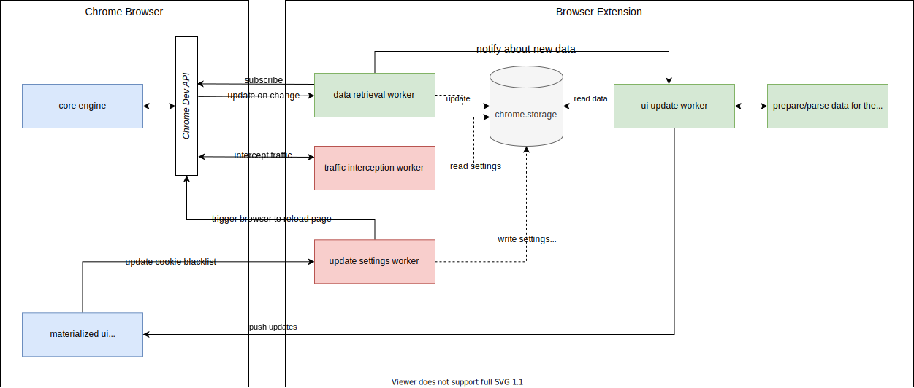

# Cookie Analysis Tool


### Table of contents

<!--ts-->
* [Purpose](#purpose)
* [Ideas](#ideas)
* [Future Improvements](#future-improvements)
* [Documentation](#documentation)
  * [Sketches](#sketches)
  * [Development modules](#development-modules)
  * [White box view](#whitebox-view)
* [Cloudfest Hackathon](#cloudfest-hackathon)
* [Development](#development)
  * [How to run the project?](#running-the-project)
* [Glossary](#glossary)
<!--te-->

## Problem Description
Private browsing on the internet is a concern of users [[1]]( https://www.statista.com/statistics/617422/online-privacy-measures-worldwide/ ). To address this concern, browser providers continuously try to provide features that supplement anonymous browsing [[2]]( https://educatedguesswork.org/posts/private-browsing/ ).
One of that features is blocking 3rd party cookies to stop cross-side tracing.
This increases privacy, but also affects the functionality of currently existing websites as a lot of embedded elements on a website, such as iframes, are heavily using 3rd party cookies.

By mid 2024, all 3rd party cookies will be blocked in most browsers, including Google Chrome [[3]]( https://privacysandbox.com/open-web/#the-privacy-sandbox-timeline ) (e.g. Safari is blocking 3rd party cookies already; state: 2023-03-19). 
Google Chrome is with a marked share of 79.7% the most widely adopted browser in February 2023 [[4]]( https://www.w3schools.com/browsers/ ). Due to that, the upcoming change will have a significant impact on the browsing experience,
and internet marketing industries if not addressed in time.

## Purpose
With this project, we want to create awareness for the upcoming changes caused by the blocking of 3rd party cookies in commonly used web browsers, such as Google Chrome.
In detail, we want to provide a tool that allows technical, and non-technical stakeholders to analyze a website and get clear answers regarding:
1. Is the website affected by the blocking of 3rd party cookies?
2. What 3rd party cookies is the website using?
3. How would the website look like if 3rd party cookies are blocked?
4. (That is the origin of 3rd party cookies used on the website?)

## Audience
This project is addressed to technical, and none-technical stakeholders that use, or consume 3rd party cookies on a website in their work context.

## Ideas
- TBD

## Future Improvements
- TBD

## Documentation
### Sketches


## Development modules

First sketch of the approach of cutting the project into modules.


## Whitebox view




### Cloudfest Hackathon
This Extension was developed during the [Cloudfest Hackathon 2023](https://www.cloudfest.com/hackathon). 

## Development

### Running the project

```shell
npm run watch
```
Afterwards add the `build` folder in your chrome extensions (after enabling developer mode). 

# Glossary
