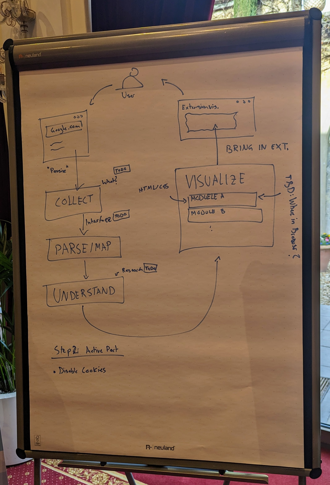
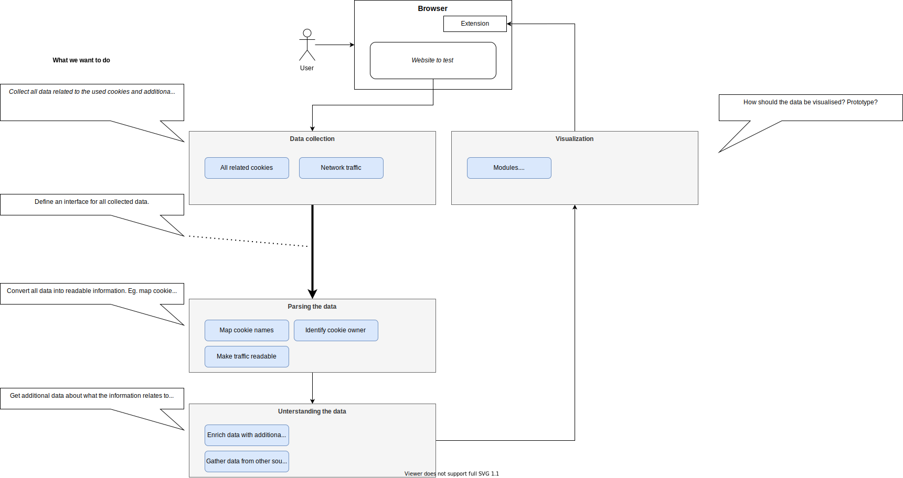

# Cookie Analysis Tool

### Table of contents

<!--ts-->

- [Cookie Analysis Tool](#cookie-analysis-tool)
  - [Run app in development](#run-app-in-development)
    - [Starts the React development server:](#starts-the-react-development-server)
    - [Watches for changes and rebuilds your webpack configuration in development mode:](#watches-for-changes-and-rebuilds-your-webpack-configuration-in-development-mode)
  - [Build app for production](#build-app-for-production)
    - [Builds both the React app and the webpack configuration for production.](#builds-both-the-react-app-and-the-webpack-configuration-for-production)
  - [Table of contents](#table-of-contents)
  - [Purpose](#purpose)
  - [Ideas](#ideas)
  - [Future Improvements](#future-improvements)
  - [Documentation](#documentation)
    - [Sketches](#sketches)
  - [Development modules](#development-modules)
  - [Whitebox view](#whitebox-view)
    - [Architecture Decision Records (ADRs)](#architecture-decision-records-adrs)
* [Cloudfest Hackathon](#cloudfest-hackathon)
  - [Development](#development)
    - [Running the project](#running-the-project)
- [Glossary](#glossary)
<!--te-->

## Purpose

Many websites rely on the usage of 3rd party cookies. By mid 2024, all 3rd party cookies will be blocked in most browsers, including Google Chrome (e.g. Safari is already blocking those cookies).
With this browser extension we want to give the opportunity to evaluate a webpage for relying on 3rd party cookies.

## Ideas

- TBD

## Future Improvements

- TBD

## Documentation

### Sketches



## Development modules

First sketch of the approach of cutting the project into modules.



## Whitebox view


## Architecture Decision Records (ADRs)

Find the ADRs [here](docs/architecture/ADRs.md).

### Cloudfest Hackathon

This Extension was developed during the [Cloudfest Hackathon 2023](https://www.cloudfest.com/hackathon).

## Development

### Running the project

```shell
# Install the dependencies 
npm i
# Build react app and watch changes in the extension folder
npm run watch
```

Afterwards add the `build` folder in your chrome extensions (after enabling developer mode).

#### Wacky Hackathon things:
In order to have the `storage/cookies.ts` available in the react-app we need to copy it in the `prebuild` of the react `package.json`.

# Glossary
